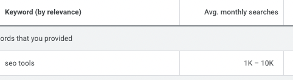
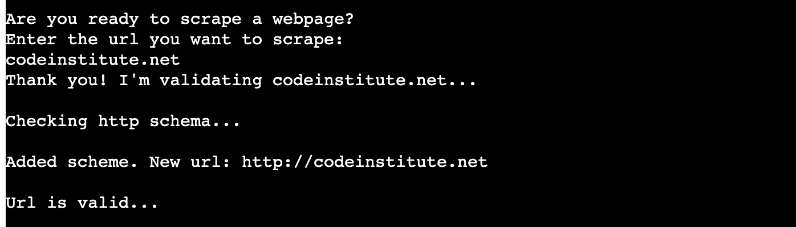
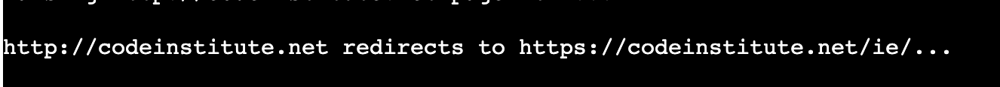
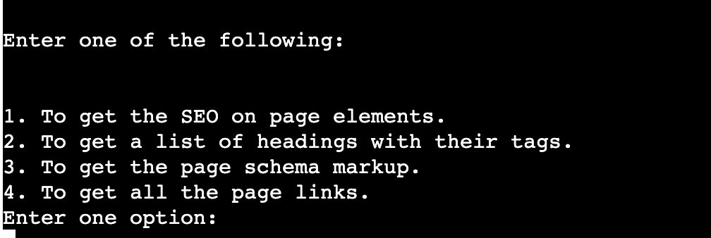
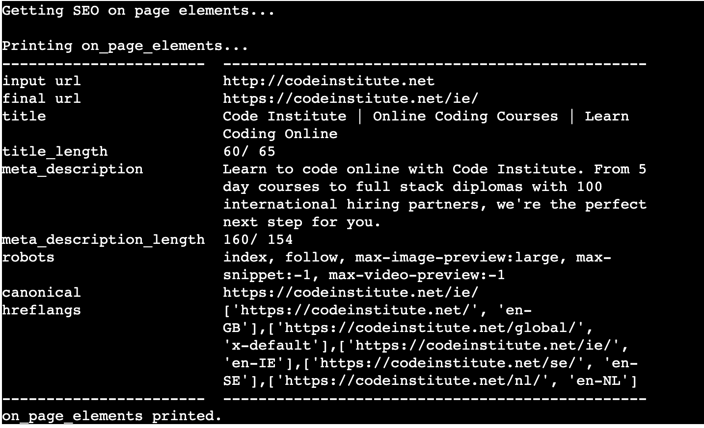
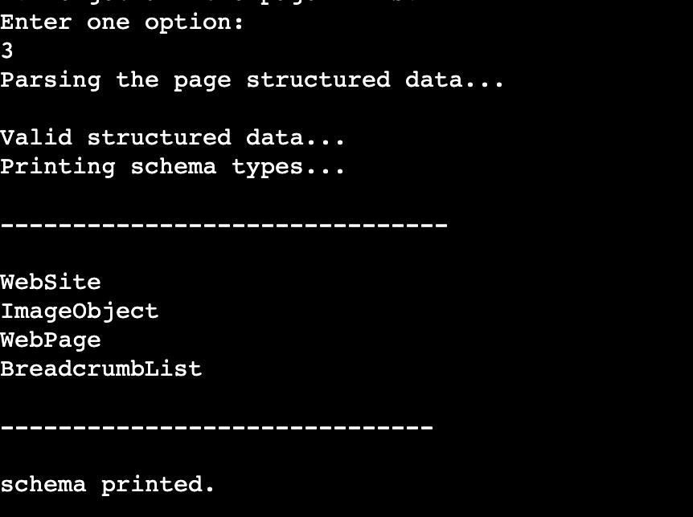
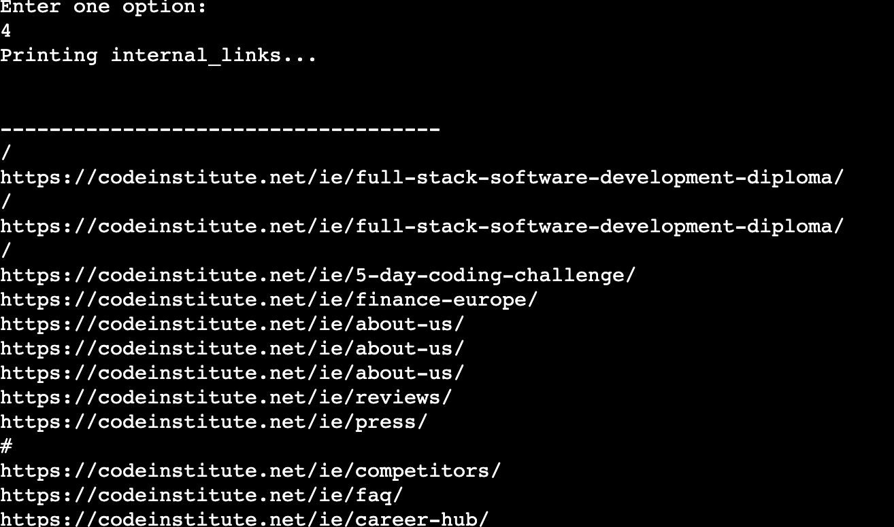
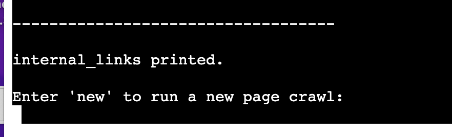
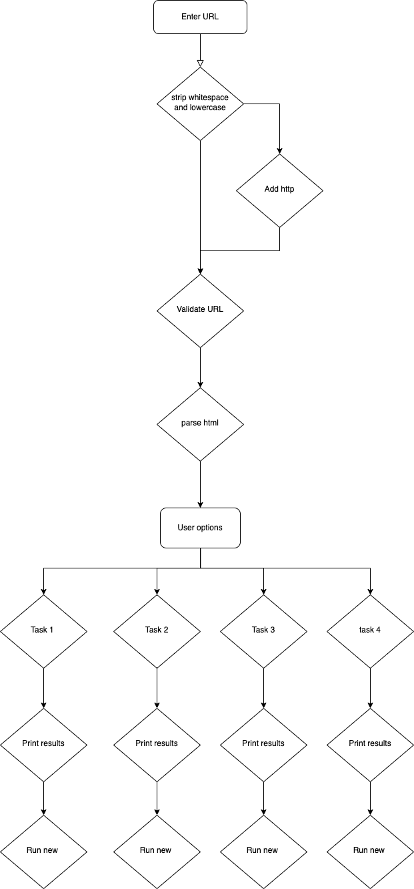
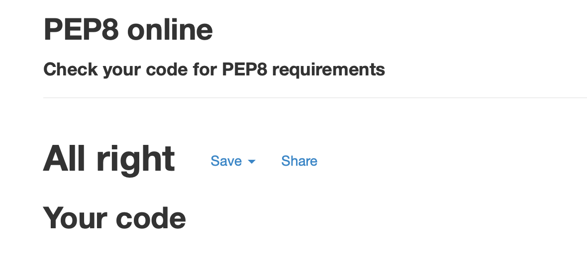

# Project 3 - SEO tools

- [Repository](https://github.com/jannis-kiriasis/seo-tools)
- [Live application](https://jk-seo-tools.herokuapp.com/)

## Table of contents
-   [Introduction](#introduction)
-	[User Experience (UX)](#user-experience-ux---user-stories)
-	[Features](#features)
-	[Where user stories meet features](#where-user-stories-meet-features)
-	[Flowchart](#flowchart)
-   [Features left to implement](#features-left-to-implement)
-	[Technologies and tools used](#technologies-and-tools-used)
-	[Testing](#testing)
-	[Deployment](#deployment)
-   [Acknowledgements](#acknowledgements)

## Introduction

SEO Tools is an easy to use collection of... SEO tools!

SEO is a high-demand field and SEO professionals always rely on tools to run
basic to more advanced tasks. Some of them are:
- Getting all the metadata and SEO on-page element of a webpage
- Getting all the headings of a webpage
- Getting the schema mark-up of a webpage
- Get a list of internal links of a webpage
- much more...

This information is used to assess whether or not something needs to be 
optimised.

A quick search with Google Keywords Planner can reveal how many monthly searches
there are for 'SEO tools'.

And this is only for the exact match keyword. 

Think about all of the alternatives and synonyms.

### Who is SEO Tools for?
SEO professionals looking for an easy to use suit of SEO tools.

### What SEO tools offer:
A webpage scraper able to:
- get all of the most important on-page elements.
- get all the headings of a page with related tags.
- get the schema markup of a page.
- get a list of all the links on the webpage.

## User Experience (UX) - user stories
Now that we are familiar with SEO Tools, the target audience and the offering, 
we are looking at the needs users may have. 
Following, you can find the users' stories covering the main users' needs.

### Visitor goals

**User stories**  

| User stories                                                         |
|----------------------------------------------------------------------|
| As a user, I want to easily understand the main purpose of the site  |
| As a user, I want to be able to scrape a webpage                     |
| As a user, I want to get a list of SEO on-page elements              |
| As a user, I want to get a list of all the webpage headings          |
| As a user, I want to get a list of all of the schema types on a page |
| As a user, I want to get a list of all the links on a webpage        |
| As a user, I want to be able to make another scrape easily           |
| As a user, I want to be able to copy the results                     |

## Features

In the following paragraphs, we are going to see what features appear on the
application and where they meet the users' needs.

### Global features

1.	**Input URL**  
    A field to let the user enter a URL to scrape.

    

2.	**URL validatior**  
    A logic that validates the url entered. The program has 4 different types of 
    validation:
    - Checks whether there are whitespaces at the beginning and end of the 
    entered URL and strips them
    - Checks whether there are uppercase letters and lowercase them.
    - Checks whether the entered URL has an http scheme. If not, the program
    adds it automatically.
    - checks whether the URL is well formatted.
    - checks whether the URL is accessible.
    - checks whether the URL exists at all.

    

3.	**Redirection checker**  
    The redirection checker sends a http request and gets the final URL of 
    the request sent. The webpage scraped will be the final URL after all of
    the redirects.

    

4.	**Options selection**  
    As mentioned, the program allows the user to run 4 tasks:
    1. Get the SEO on-page elements
    2. Get a list of headings with their tags.
    3. Get the page schema markup.
    4. Get all the page links.

    To run all of the above tasks, the final URL (user input + redirects) is 
    used.

    

    **1. On-page elements**  
    Option 1. The program looks for the following elements:
    - user input URL
    - final URL after redirects
    - webpage title tag
    - webpage meta description
    - webpage robots tag
    - webpage canonical tag
    - webpage hreflang tags

    The program also calculates:
    - title tag length
    - meta description length

    If any of the above elements aren't available, a custom message will appear
    instead of the actual element.

    The result is a well-formatted printed output easy to copy and paste.

    

5.	**2. Headings list**  
    Option 2. The program scraper the webpage and get a list of all the headings
    with related tags. If the headings aren't available, a custom message will
    be printed instead.

    

6.	**3. Schema mark up**  
    Option 3. The program returns a list of the schema markup types used on the
    page. Since there are different ways to add schema markup on a webpage, 
    the program is limited to 1 (the main) way. 
    
    In any other case, a custom message will appear on the screen. 
    In future releases, more ways to scrape json files can be added.

    

7.	**4. On-page links**  
    Option 4. The program returns a list of all the links on the page. This 
    list can be used for internal linking analysis.

    

    "#" and "/" are not errors:
    - "#" is used in href tags to self-link a page, to not open a new page (in
    dropdown menus for example).
    - "/" is a link to the homepage (links can be absolute or relative. 
    Relative links to the homepage will only appear as "/". 
    In future developments, a logic to transform all the relative links into
    absolute links can be developed.)

8.	**New URL**  
     At the end of any of the 4 tasks, the program asks to enter "new" if the 
     user is willing to scrape a new URL.

     In future developments, a logic to add the 3 options that haven't been
     run for the same URL can be added together with the "new" option.

    

## Where user stories meet features

In the following paragraph, I’m going to match features with user needs (user stories). 
The features are numbered and the same feature numbers appear in the table below.

| User stories                                                         | Features |
|----------------------------------------------------------------------|----------|
| As a user, I want to easily understand the main purpose of the app   | 1        |
| As a user, I want to be able to scrape a webpage                     | 1,2,3    |
| As a user, I want to get a list of SEO on-page elements              | 4        |
| As a user, I want to get a list of all the webpage headings          | 5        |
| As a user, I want to get a list of all of the schema types on a page | 6        |
| As a user, I want to get a list of all the links on a webpage        | 7        |
| As a user, I want to be able to make another scrape easily           | 8        |
| As a user, I want to be able to copy the results                     | 8        |

## Flowchart

The program has been developed with the following logic in mind.

This was a first draft. Every node runs multiple subtasks to complete the task.

## Features left to implement 

In future releases, the following features can be added:
1. More ways to scrape schema markup
2. More options to run other tasks at the end of a task
3. A sitemap generator
4. A logic to transform relative URLs into absolute URLs in task 3.

## Technologies and tools used

- Language: [Python 3.10.5](https://www.python.org/downloads/)
- Version control: [Git](https://git-scm.com/)
- Public repository: [GitHub](https://github.com/)
- Deployment: [Heroku](https://dashboard.heroku.com/)
- Web scraping library: [BeautifulSopu](https://pypi.org/project/beautifulsoup4/)
- HTTP requests library: [Requests](https://pypi.org/project/requests/)
- Validators library: [Validators](https://pypi.org/project/validators/) 
- Jsons library: [Jsons](https://pypi.org/project/jsons/)
- Textwrap library: [Textwrap](https://docs.python.org/3/library/textwrap.html)
- Tabulate library: [Tabulate](https://pypi.org/project/tabulate/)

## Testing

I've carried out the following tests:

1. [PEP 8 testing](#pep-8-testing)
2. [Functionality testing](#functionality-testing)
3. [Browsers compatibility](#browser-compatibility)
4. [Responsiveness testing](#responsiveness-testing)
5. [User stories testing](#user-stories-testing)

### PEP 8 testing
The run.py file has been passed through [PEP8 Online](http://pep8online.com). 
There are no issues reported.

### Functionality testing

|      Test Label           |      Test Action                                                      |      Expected Outcome                                                                                                                     |      Test Outcome     |
|---------------------------|-----------------------------------------------------------------------|-------------------------------------------------------------------------------------------------------------------------------------------|-----------------------|
|     Input URL             |     Enter valid   URL without HTTP                                    |     The program   adds HTTP scheme and run.                                                                                               |     PASS              |
|     Input URL             |     Enter   invalid URL without extension                             |     The program   tries to validate the URL and restarts.                                                                                 |     PASS              |
|     Input URL             |     Enter valid   URL of not accessible site                          |     The program   tries to access the website but requires a new URL.                                                                      |     PASS              |
|     Input URL             |     Enter valid   URL                                                 |     The program   runs.                                                                                                                   |     PASS              |
|     Input URL             |     Enter valid   URL with whitespaces at the end                     |     The program   strips the whitespaces and run.                                                                                         |     PASS              |
|     Input URL             |     Enter valid   URL with uppercase letters                          |     The program   transforms the string to lowercase.                                                                                     |     PASS              |
|     Option 1              |     Enter valid   URL then enter 1                                    |     Prints   available SEO on page elements. If some element requested isn’t available a   custom message will appear on the terminal.    |     PASS              |
|     Option 2              |     Enter valid   URL then enter 2                                    |     Prints all the   headings with their tag.                                                                                             |     PASS              |
|     Option 3              |     Enter valid   URL then enter 3                                    |     Prints   available schema structured data. If schema isn’t available a custom message   will appear on the terminal.                  |     PASS              |
|     Option 4              |     Enter valid   URL then enter 4                                    |     Prints all   the page links.                                                                                                          |     PASS              |
|     Option   selection    |     Enter anything   different from 1 to 4                            |     Prints a   message asking to enter a valid option.                                                                                    |     PASS              |
|     Option new            |     Enter new at   the end of the program                             |     The program   will restart and ask to enter a new URL.                                                                                |     PASS              |
|     Option new            |     Enter   something different from new at the end of the program    |     The program   will ask you to enter 'new'                                                                                               |     PASS              |

### Browser compatibility

All the functionality tests have been carried out and achieved a PASS 
on the latest versions of the following browsers:
- Google Chrome
- Safari
- Firefox
- Microsoft Edge

### Responsiveness testing

All the functionality tests have been carried out and achieved a PASS 
on the following screen resolutions:
- 365x667 (iPhone SE)
- 540x720 (Surface Duo)
- 1280x800 (Nest Hub Max)
- 2560x1600 (Macbook Pro M1)

### User stories testing

I've tested whether the user needs have been satisfied with the features created.

| User stories                                                         | Features | Results |
|----------------------------------------------------------------------|----------|---------|
| As a user, I want to easily understand the main purpose of the site  | 1        | PASS    |
| As a user, I want to be able to scrape a webpage                     | 1,2,3    | PASS    |
| As a user, I want to get a list of SEO on-page elements              | 4        | PASS    |
| As a user, I want to get a list of all the webpage headings          | 5        | PASS    |
| As a user, I want to get a list of all of the schema types on a page | 6        | PASS    |
| As a user, I want to get a list of all the links on a webpage        | 7        | PASS    |
| As a user, I want to be able to make another scrape easily           | 8        | PASS    |
| As a user, I want to be able to copy the results                     | 8        | PASS    |

## Deployment

I've deployed the application on Heroku. The app was developed on Gitpod and 
pushed to its GitHub repository using git command lines in the terminal. 
Every time a commit pushed to the website's repository updates the files, 
Heroku automatically updates the live demo.

To deploy the application:
1. Update the reuirements.txt file with `pip3 freeze > requirements.txt` in the terminal
2. Commit changes
3. [Go to Heroku](https://id.heroku.com/login) and create an account
4. From the Heroku dashboard click on "Create new app"
5. Enter a unique name and create app
6. On the application configuration page click on settings
7. Scroll up to Config Vars and add PORT 8000
8. Scroll down to buildpacks
9. Add Python buildpack and then node.js buildpack in this order. Save
10. Go to the deploy tab and under deployment method select GitHub 
11. Enter the name of the repository (https://github.com/jannis-kiriasis/seo-tools)
12. Click connect to connect GitHub to Heroku
13. Scroll down and chose automatic deployment or manual deployment then save
14. On the application configuration page click on Open App.
14. Run the program https://jk-seo-tools.herokuapp.com/

To clone the website:
1. Go to the GitHub repository [SEO-Tools](https://github.com/jannis-kiriasis/seo-tools)
2. Open the dropdown 'Code'
3. Copy the given URL (https://github.com/jannis-kiriasis/seo-tools.git)
4. Open 'Git Bash' on your favourite code editor and select the location 
where you want to save the cloned directory
5. Type `git clone https://github.com/jannis-kiriasis/seo-tools.git` and 
press enter to create a local copy

## Acknowledgements

I'm an SEO specialist and I've been doing SEO for the last 5 years. 
So I have some experience with Google tools and marketing.

Brian Macharia, my mentor, helped me test the application functionalities and 
provide excellent recommendations.

The following tutorials, videos and threads have helped me to create 
parts of this application. The code has been edited as needed.

[Tutorial to send HTTP requests with beautifulsoup](https://www.youtube.com/watch?v=pFfLiCiTJ0Y&t=302s)

[Tutorial to parse HTML elements needed for SEO analysis](https://www.danielherediamejias.com/)guide-seo-onpage-scraping-python/

[Return list of keys in a dictionary](https://stackoverflow.com/questions/16819222/how-to-return-dictionary-keys-as-a-list-in-python)

[Convert list to string](https://stackoverflow.com/questions/5618878/how-to-convert-list-to-string)

[validate URL](https://www.codespeedy.com/check-if-a-string-is-a-valid-url-or-not-in-python/#:~:text=To%20check%20whether%20the%20string,%E2%80%A6)

[Wrap long string of text](https://stackoverflow.com/questions/16430200/a-good-way-to-make-long-strings-wrap-to-newline)

[Create tables in python](https://www.statology.org/create-table-in-python/)