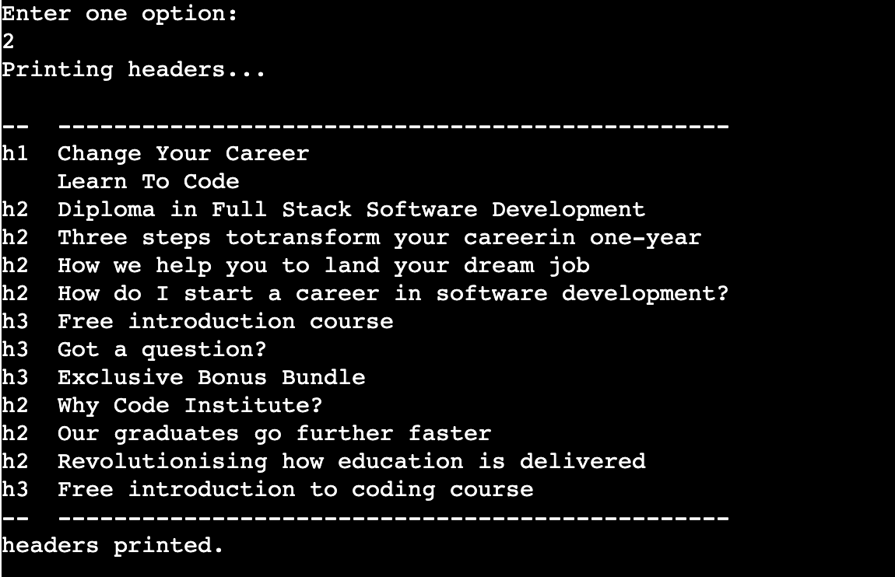

# Project 3 - SEO tools

## Table of contents
-   [Introduction](#introduction)
-	[User Experience (UX)](#user-experience-ux---user-stories)
-	[Features](#features)
-	[Where user stories meet features](#where-user-stories-meet-features)
-	[Wireframes](#wireframes)
-   [Features left to implement](#features-left-to-implement)
-	[Technologies and tools used](#technologies-and-tools-used)
-	[Testing](#testing)
-	[Issues fixed](#issues-fixed)
-	[Deployment](#deployment)
-	[Credits](#credits)
-   [Acknowledgements](#acknowledgements)
-   [Disclaimer](#disclaimer)

## Introduction

SEO tools is an easy to use collection of... SEO tools!

SEO is a high demand field and SEO professionals always rely on tools to run
basic to more advanced tasks. Some of them are:
- Getting all the metadata and SEO on page element of a webpage
- Getting all the headings of a webpage
- Getting the schema mark up of a webpage
- Get a list of internal links of a webpage
- much more...

These information are used to assess whether or not something needs to be 
optimised.

A quick search with Google Keywords Planner can reveal how manu monthly searches
there are for 'SEO tools'.

And this is only for the exact match keyword. 

Think about all of the alternatives and synonyms.

### Who is SEO Tools for?
SEO professionals looking for an easy to use suit of SEO tools.

### What SEO tools offer:
A webpage scraper able to:
- get all of the most important on page elements.
- get all the headings of a page with related tag.
- get the schema markup of a page.
- get a list of all the links on the webpage.

## User Experience (UX) - user stories
Now that we are familiar with SEO Tools, the target audience and offering, 
we are looking at the needs users may have. 
Following, you can find the users' stories covering the main users' needs.

### Visitor goals

**User stories**  

| User stories                                                         |
|----------------------------------------------------------------------|
| As a user, I want to easily understand the main purpose of the site  |
| As a user, I want to be able to scrape a webpage                     |
| As a user, I want to get a list of SEO on page elements              |
| As a user, I want to get a list of all the webpage headings          |
| As a user, I want to get a list of all of the schema types on a page |
| As a user, I want to get a list of all the links on a webpage        |
| As a user, I want to be able to make another scrape easily           |
| As a user, I want to be able to copy the results                     |

## Features

In the following paragraphs, we are going to see what features appear on the
application and where they meet the users' needs.

### Global features

1.	**Input url**  
    A field to let the user enter a url to scrape.

    

2.	**URL validatior**  
    A logic that validates the url entered. The program has 4 different types of 
    validation:
    - Checks whether there are whitespaces at the beginning and end of the 
    entered url and strips them
    - Checks whether there are uppercase letters and lowercase them.
    - Checks whether the entered url has an http scheme. If not, the program
    adds it automatically.
    - checks whether the url is well formatted.
    - checks whether the url is accessible.
    - checks whether the url exists at all.

    

3.	**Redirection checker**  
    The redirection checker send an http requests and get the final url of 
    the request sent. The webpage scraped will the the final url after all of
    the redirects.

    

4.	**Options selection**  
    As mentioned, the program allows the user to run 4 tasks:
    1. Get the SEO on page elements
    2. Get a list of headings with their tags.
    3. Get the page schema markup.
    4. Get all the page links.

    To run all of the above tasks, the final url (user input + redirects) is 
    used.

    

    **1. On page elements**  
    Option 1. The program looks for the following elements:
    - user input url
    - final url after redirects
    - webpage title tag
    - webpage meta description
    - webpage robots tag
    - webpage canonical tag
    - webpage hreflang tags

    The program also calculates:
    - title tag length
    - meta description length

    If any of the above elements isn't available, a custom message will appear
    instead of the actual element.

    The result, is a well formatted printed output easy to copy and past.

    

5.	**2. Headings list**  
    Option 2. The program scraper the webpage and get a list of all the headings
    with related tags. If the headings aren't available, a custom message will
    be printed instead.

    

6.	**3. Schema mark up**  
    Option 3. The program return a list of the schema mark up types used on the
    page. Since there are different ways to add a schema markup on a webpage, 
    the program is limited to 1 (the main) way. 
    
    In any other case a custom message will appear on the screen. 
    In future releases more ways to scrape json files can be added.

    

7.	**4. On page links**  
    Option 4. The program returns a list of all the links on the page. This 
    list can be used for internal linking analysis.

    

    "#" and "/" are not errors:
    - "#" is used in href tags to self link a page, to not open a new page (in
    dropdown menus for example).
    - "/" is a link to the homepage (links can be absolute or relative. 
    Relative links to the homepage will only appear as "/". 
    In future developments, a logic to transform all the relative links in
    absolute links can be developed.)

8.	**New url**  
     At the end of any of the 4 tasks, the program asks to enter "new" if the 
     users is willing to scrape a new url.

     In future developments a logic to add the 3 options that haven't been
     run for the same url can be added together with the "new" option.

    

## Where user stories meet features

In the following paragraph, I’m going to match features with user needs (user stories). 
The features are numbered and the same feature numbers appear in the table below.

| User stories                                                         | Features |
|----------------------------------------------------------------------|----------|
| As a user, I want to easily understand the main purpose of the site  | 1        |
| As a user, I want to be able to scrape a webpage                     | 1,2,3    |
| As a user, I want to get a list of SEO on page elements              | 4        |
| As a user, I want to get a list of all the webpage headings          | 5        |
| As a user, I want to get a list of all of the schema types on a page | 6        |
| As a user, I want to get a list of all the links on a webpage        | 7        |
| As a user, I want to be able to make another scrape easily           | 8        |
| As a user, I want to be able to copy the results                     | 8        |

## Wireframes

The program has been develped with the following logic in mind.

This was a first draft. Evety node runs multiple subtasks to complete the task.

## Features left to implement 

In the future releases, the following features can be added:
1. More ways to scrape schema markup
2. More options to run other tasks at the end of a task
3. A sitemap generator
4. A logic to trasnform relative urls in absolute urls in task 3.

## Technologies and tools used

- Language: [Python 3.10.5](https://www.python.org/downloads/)
- Version control: [Git](https://git-scm.com/)
- Public repository: [GitHub](https://github.com/)
- Deployement: [Heroku](https://dashboard.heroku.com/)
- Web scraping library: [BeautifulSopu](https://pypi.org/project/beautifulsoup4/)
- http requests library: [Requests](https://pypi.org/project/requests/)
- validators library: [Validators](https://pypi.org/project/validators/) 
- jsons library: [Jsons](https://pypi.org/project/jsons/)
- textwrap library: [Textwrap](https://docs.python.org/3/library/textwrap.html)
- tabulate library: [Tabulate](https://pypi.org/project/tabulate/)

## Testing

I've carried out the following tests:

1. [PEP 8 testing](#pep-8-testing)
2. [Funtionality testing](#functionality-testing)
3. [Browsers compatibility](#browser-compatibility)
4. [Responsiveness testing](#responsiveness-testing)
5. [User stories testing](#user-stories-testing)

### PEP 8 testing
The run.py file has been passed through [PEP8 Online](http://pep8online.com). 
There are no issues reported.

### Functionality testing

|      Test Label           |      Test Action                                                      |      Expected Outcome                                                                                                                     |      Test Outcome     |
|---------------------------|-----------------------------------------------------------------------|-------------------------------------------------------------------------------------------------------------------------------------------|-----------------------|
|     Input url             |     Enter valid   url without http                                    |     The program   adds http scheme and run.                                                                                               |     PASS              |
|     Input url             |     Enter   invalid url without extension                             |     The program   tries to validate the url and restarts.                                                                                 |     PASS              |
|     Input url             |     Enter valid   url of not accessible site                          |     The program   tries to access to website but requires a new url.                                                                      |     PASS              |
|     Input url             |     Enter valid   url                                                 |     The program   runs.                                                                                                                   |     PASS              |
|     Input url             |     Enter valid   url with whitespaces at the end                     |     The program   strips the whitespaces and run.                                                                                         |     PASS              |
|     Input url             |     Enter valid   url with uppercase letters                          |     The program   transforms the string to lowercase.                                                                                     |     PASS              |
|     Option 1              |     Enter valid   url then enter 1                                    |     Prints   available SEO on page elements. If some element requested isn’t available a   custom message will appear on the terminal.    |     PASS              |
|     Option 2              |     Enter valid   url then enter 2                                    |     Prints all the   headings with their tag.                                                                                             |     PASS              |
|     Option 3              |     Enter valid   url then enter 3                                    |     Prints   available schema structured data. If schema isn’t available a custom message   will appear on the terminal.                  |     PASS              |
|     Option 4              |     Enter valid   url then enter 4                                    |     Prints all   the page links.                                                                                                          |     PASS              |
|     Option   selection    |     Enter anything   different from 1 to 4                            |     Prints a   message asking to enter a valid option.                                                                                    |     PASS              |
|     Option new            |     Enter new at   the end of the program                             |     The program   will restart and ask to enter a new url.                                                                                |     PASS              |
|     Option new            |     Enter   something different from new at the end of the program    |     The program   will ask you to enter new                                                                                               |     PASS              |

### Browser compatibility

All the functionality tests have been carried out and achieved a PASS on the latest versions of the following browsers:
- Google Chrome
- Safari
- Firefox
- Microsoft Edge

### Responsiveness testing

All the functionality tests have been carried out and achieved a PASS on the following screen resolutions:
- 365x667 (iPhone SE)
- 540x720 (Surface Duo)
- 1280x800 (Nest Hub Max)
- 2560x1600 (Macbook Pro M1)

The website has also been tested for responsiveness on [ami.responsivedesign.is](http://ami.responsivedesign.is/) with the following results:
- [index.html](https://ui.dev/amiresponsive?url=https://jannis-kiriasis.github.io/insured/index.html)
- [life-insurance-calculator.html](https://ui.dev/amiresponsive?url=https://jannis-kiriasis.github.io/insured/life-insurance-calculator.html)
- [application-form.html](https://jannis-kiriasis.github.io/insured/application-form.html)

### User stories testing

I've tested whether the user needs have been satisfied with the features created.

| User stories                                                         | Features | Results |
|----------------------------------------------------------------------|----------|---------|
| As a user, I want to easily understand the main purpose of the site  | 1        | PASS    |
| As a user, I want to be able to scrape a webpage                     | 1,2,3    | PASS    |
| As a user, I want to get a list of SEO on page elements              | 4        | PASS    |
| As a user, I want to get a list of all the webpage headings          | 5        | PASS    |
| As a user, I want to get a list of all of the schema types on a page | 6        | PASS    |
| As a user, I want to get a list of all the links on a webpage        | 7        | PASS    |
| As a user, I want to be able to make another scrape easily           | 8        | PASS    |
| As a user, I want to be able to copy the results                     | 8        | PASS    |

## Issues fixed

1. Cannot set properties of undefined (setting 'onclick'): I was using a function that I actually didn't need. I removed the function and the issue was gone.
2. Cannot read properties of null (reading 'classList'): I was trying to add a class property to an element that didn't exist (past questions). In my `progressUpdate()` function a past question exists only if runningQuestion is in `runningQuestion[1]`, while in `runningQuestion[0]` past questions don't exists since `runningQuestion[0]` is the first question. So with an if stamement I made the code generating the error, running only if `runningQuestion !== 0`. This worked.
3. Override iPhone / iPad default styling of submit button. The button isn't styled as declared in the CSS. Solution: add to the class .button `-webkit-appearance: none;`. [Stackoverflow](https://stackoverflow.com/questions/5438567/css-submit-button-weird-rendering-on-ipad-iphone).
4. On mobile yes / no buttons were retaining the :hover styling after being clicked. I made the hover styling exist only for devices where hover is real with a media query. [Stackoverflow](https://stackoverflow.com/questions/23885255/how-to-remove-ignore-hover-css-style-on-touch-devices).

## Deployment

I've deployed the website on GitHub Pages. The website was developed on Gitpod and pushed to its GitHub repository using git command lines in the terminal. Every time a commit pushed to the website's repository updates the HTML and CSS files, GitHub Pages automatically updates the live demo.
To deploy the website:
1. from the GitHub repository, click on 'settings'
2. find and click on 'pages' on the setting sidebar menu
3. select the branch to be used. In this case 'main'
4. Refresh the page and in a few minutes, the following message will appear if the website was deployed correctly

To clone the website:
1. Go to the GitHub repository [Insured](https://github.com/jannis-kiriasis/insured)
2. Open the dropdown 'Code'
3. Copy the given url (https://github.com/jannis-kiriasis/insured.git)
4. Open 'Git Bash' on your favourite code editor and select the location where you want to save the cloned directory
5. Type `git clone https://github.com/jannis-kiriasis/insured.git` and press enter to create a local copy

## Credits
### Graphics

- [Calculator icons created by Vitaly Gorbachev - Flaticon](https://www.flaticon.com/free-icons/calculator)
- [Questionnaire icons created by netscript - Flaticon](https://www.flaticon.com/free-icons/questionnaire)
- [Submit icons created by Freepik - Flaticon](https://www.flaticon.com/free-icons/submit)
- [Arrow icons created by th studio - Flaticon](https://www.flaticon.com/free-icons/arrow)
- [Arrow icons created by Handicon - Flaticon](https://www.flaticon.com/free-icons/arrow) 

## Acknowledgements

I'm an SEO specialist working for an insurance company in Dublin. So I have some experience with Google tools and marketing life insurance policies to people.

Brian Macharia, my mentor, helped me test the website functionalities and provide excellent recommendations.

I've followed [this video](https://www.youtube.com/watch?v=49pYIMygIcU&t=2066s) by Code Explained to create the logic to loop through the questions and create the progress bar (`progressUpdate()`, `nextQuestion()`, `leftQuestions()` and related event listeners and varibles). I've edited the code to fit this website.

I've used [this guide](https://www.javascripttutorial.net/javascript-dom/javascript-form-validation/) published on javascripttutorial.net to create part of the username input validation logic. The code was edited to fit this website.

I've used [this thread](https://stackoverflow.com/questions/17616624/detect-if-string-contains-any-spaces) to detect if the username input value contains any white spaces.

To create the README.md file I've used a previously created by me README.md [digibooking README.md](https://github.com/jannis-kiriasis/digibooking/blob/main/README.md) and updated it as needed.

## Disclaimer

I'm not a financial advisor. This website doesn't constitute financial advice and it has been created as part of a post graduate degree project. 

Your data aren't retained and will be deleted as the session expires. 

By clicking apply, you aren't actually applying for a life insurance policy. 

More factors need to be taken into consideration when deciding if to get a life insurance policy and calculating the amount. Don't rely on this website for your life insurance but contact a financial advisor.
